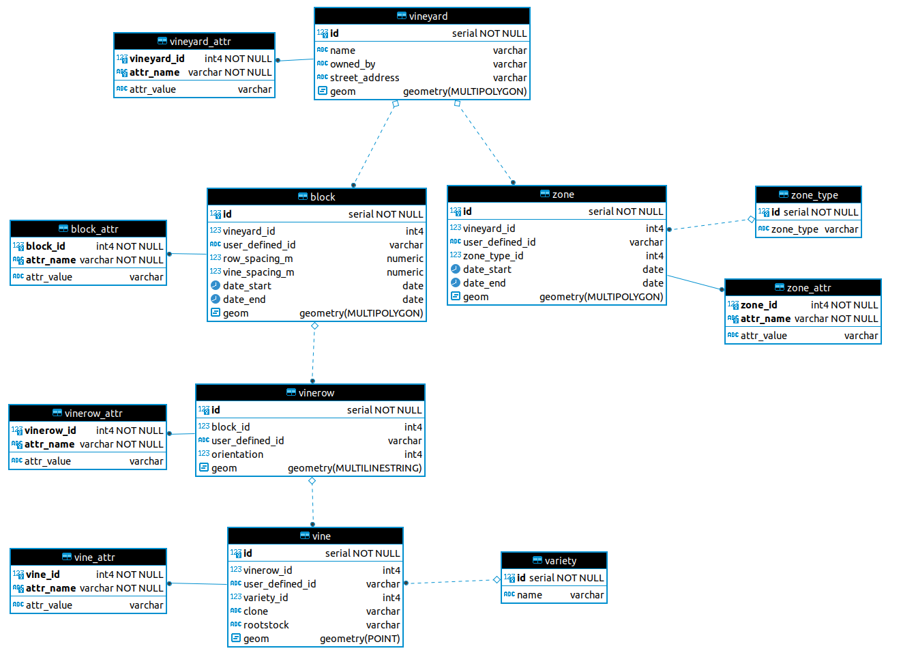

# Collabriculture vineyard logical data model
#### This repository contains a set of scripts for creating an instance of the Collabriculture logical data model for vineyards in a PostgreSQL/PostGIS relational database.

## Set up the database
#### Create a blank database called `vineyard_db` (or any other name you like).
``` sh
psql -c 'create database vineyard_db;'
```

#### Create related tables using the SQL script `logical-schema.sql`.
``` sh
psql -d vineyard_db -f logical-schema.sql
```

#### You should now have a database with a structure like this:


#### Load varieties lookup table with external data.
``` sh
psql -d vineyard_db -f load-varieties.sql
```

#### Create example views, transposing the attributes into columns, joining them to core tables, and producing stats from the core data.
``` sh
psql -d vineyard_db -f example-views.sql
```

#### Alternatively, run the shell script `create-and-setup-db.sh` with a single argument for the name of the database you want to create, eg:
``` sh
./create-and-setup-db.sh 'vineyard_db'
```
